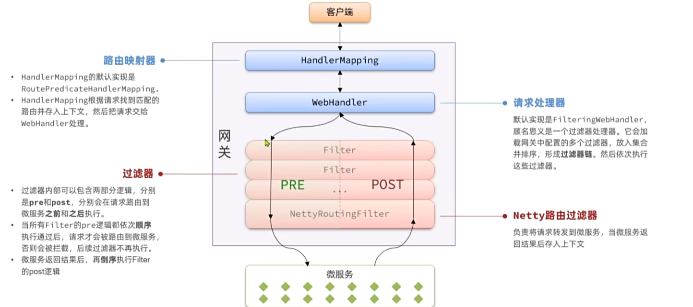

# 微服务
服务化，也就是把一个大项目中的多个模块拆分成多个独立的小项目
- 粒度小
- 团队自治
- 服务自治

# SpringCloud


# 服务治理-注册中心
## 三种角色
- 服务提供者：暴露服务接口，给其他服务使用
- 服务消费者：调用其他服务的接口
- 注册中心：记录并且监控微服务的实例状态，推送服务变更信息

## 消费者怎么知道服务提供者的具体地址
服务提供者会在启动时将自己的服务信息注册到注册中心，消费者可以从注册中心去拉取服务提供者的相关信息

## 消费者怎么知道服务提供者的状态变更
服务提供者会通过心跳机制向注册中心报告自己的健康状态，当心跳异常的时候，注册中心会将服务从服务列表中移除，并且通知订阅了这个服务的消费者

## 当提供者有多个实例的时候，消费者怎么选择
通过负载均衡机制选择一个最合适的服务提供者

## 服务注册步骤
### 引入nacos依赖
```xml
        <dependency>
            <groupId>com.alibaba.cloud</groupId>
            <artifactId>spring-cloud-starter-alibaba-nacos-discovery</artifactId>
        </dependency>
```

### 配置nacos地址
```yaml
spring:
  application:
    name: item-service  # 微服务名称
  cloud:
    nacos:
      server-addr: 1.95.50.31
```

## 服务发现
### 引入依赖

### 配置nacos地址

### 服务发现
```java
        // 2.查询商品
        // 2.1 根据服务名称获取服务的实例列表
        List<ServiceInstance> instances = discoveryClient.getInstances("item-service");
        if (CollUtil.isEmpty(instances)) {
            return;
        }
        // 2.2 负载均衡
        ServiceInstance serviceInstance = instances.get(RandomUtil.randomInt(instances.size()));
```


# OpenFeign
声明式的http客户端，主要用来做服务间http请求和通信

## 快速入门
### 引入依赖
```xml
        <!-- openfeign -->
        <dependency>
            <groupId>org.springframework.cloud</groupId>
            <artifactId>spring-cloud-starter-openfeign</artifactId>
        </dependency>

        <!-- 负载均衡 -->
        <dependency>
            <groupId>org.springframework.cloud</groupId>
            <artifactId>spring-cloud-starter-loadbalancer</artifactId>
        </dependency>
```


### 通过@EnableFeignClients注解启用OpenFeign功能
```java
@MapperScan("com.hmall.cart.mapper")
@SpringBootApplication
@EnableFeignClients
public class CartApplication {
    public static void main(String[] args) {
        SpringApplication.run(CartApplication.class, args);
    }
}
```

### 编写FeignClient
```java
@FeignClient("item-service")
public interface ItemClient {
    @GetMapping("/items")
    List<ItemDTO> queryItemsByIds(@RequestParam("ids") Collection<String> ids);
}

```

### 远程调用
```java
List<ItemDTO> items = itemClient.queryItemsByIds(itemIds);
```

## 连接池
OpenFeign对http请求做了封装，但实现方式依赖Client，这种方式下，每一次请求都会创建一个Client对象，效率比较低下
但，OpenFeign支持我们使用其他方式来实现http请求的封装，主要有以下三种：
- HttpURLConnection：默认实现，不支持连接池
- ApacheHttpClient：支持连接池
- OKHttp：支持连接池
具体的源码参考：FeignBlockingLoadBalancerClient.class中的delegate

### 如何使用自定义的http框架
#### 引入http依赖
```xml
        <dependency>
            <groupId>io.github.openfeign</groupId>
            <artifactId>feign-okhttp</artifactId>
        </dependency>
```

#### 开启OpenFeign的连接池功能
```yaml
feign:
  okhttp:
    enabled: true
```

## OpenFeign最佳实践

## 日志
OpenFeign只会在FeignClient所在包的日志级别为DEBUG时才会输出日志，而OpenFeign的日志级别分为四种：
- NONE：不记录任何日志，默认级别
- BASIC：仅记录请求的方法，URL以及响应状态码和执行时间
- HEADERS：在BASIC的基础上，添加了请求头和响应头信息
- FULL：记录所有请求和响应的明细，包括头信息、请求体、元数据

### 如何自定义日志级别
声明一个Logger.Level的Bena，在其中定义日志级别
```java
public class DefaultFeignConfig {
    @Bean
    public Logger.Level feignLoggerLevel() {
        return Logger.Level.FULL;
    }
}
```

#### 局部生效
在@FeignClient注解中声明
```java
@FeignClient(value = "item-service", configuration = DefaultFeignConfig.class)
````
#### 全局生效
在@EnableFeignClients注解中声明
```java
@EnableFeignClients(basePackages = "com.hmall.api.client", defaultConfiguration = DefaultFeignConfig.class)
```


# 网关
网关网关就是保安，负责请求的路由、转发、身份校验

## 快速入门
### 创建网关服务
1.依赖
```xml
        <!-- 网关 -->
        <dependency>
            <groupId>org.springframework.cloud</groupId>
            <artifactId>spring-cloud-starter-gateway</artifactId>
        </dependency>

        <!-- nacos注册中心服务发现 -->
        <dependency>
            <groupId>com.alibaba.cloud</groupId>
            <artifactId>spring-cloud-starter-alibaba-nacos-discovery</artifactId>
        </dependency>

        <!-- 负载均衡 -->
        <dependency>
            <groupId>org.springframework.cloud</groupId>
            <artifactId>spring-cloud-starter-loadbalancer</artifactId>
        </dependency>
```
2.启动类
```java
@SpringBootApplication
public class GatewayApplication {
    public static void main(String[] args) {
        SpringApplication.run(GatewayApplication.class, args);
    }
}
```
### 配置路由规则
```yaml
server:
  port: 8080
spring:
  application:
    name: gateway
  cloud:
    nacos:
      server-addr: 1.95.50.31
    gateway:
      routes:
        - id: item-service
          uri: lb://item-service
          predicates:
            - Path=/items/**,/search/**
        - id: user-service
          uri: lb://item-service
          predicates:
            - Path=/addresses/**,/users/**
        - id: cart-service
          uri: lb://cart-service
          predicates:
            - Path=/carts/**
        - id: pay-service
          uri: lb://pay-service
          predicates:
            - Path=/pay-orders/**
        - id: trade-service
          uri: lb://trade-service
          predicates:
            - Path=/orders/**
```


## 路由属性
网关路由对应的Java类是RouteDefinition，其中常见的属性如下：
- id：路由的唯一标识
- uri：路由的目标地址
- predicates：路由断言，判断请求是否符合对应的路由规则
- filters：路由过滤器，对请求或响应做特殊处理

## 网关请求的处理流程




### 自定义网关过滤器
网关过滤器有以下两种：
- GatewayFilter：路由过滤器，作用于任意指定的路由；默认不生效，要配置到路由之后才生效
- GlobalFilter：全局过滤器，作用范围是所有路由，声明之后，自动生效


#### 自定义GlobalFilter
```java
@Component
public class LoginGlobalFilter implements GlobalFilter, Ordered {
    @Override
    public Mono<Void> filter(ServerWebExchange exchange, GatewayFilterChain chain) {
        ServerHttpRequest request = exchange.getRequest();
        HttpHeaders headers = request.getHeaders();
        System.out.println(headers);
        return chain.filter(exchange);
    }

    @Override
    public int getOrder() {
        return 0;
    }
}
```
实现GlobalFilter接口即可，order值越小，优先级越高

#### 自定义GatewayFilter


## 网关传递信息
### 网关中使用Exchange
```java
        ServerWebExchange swe = exchange.mutate()
                .request(builder -> builder.header("user-info", userInfo)).build();
```

### 公共服务中定义拦截器 保存到ThreadLocal
```java
public class UserInfoInterceptor implements HandlerInterceptor {
    @Override
    public boolean preHandle(HttpServletRequest request, HttpServletResponse response, Object handler) throws Exception {
        // 1.获取用户登录信息
        String userInfo = request.getHeader("user-info");
        // 2.是否获取了用户,如果有 存入ThreadLocal
        if (StrUtil.isNotBlank(userInfo)) {
            UserContext.setUser(Long.valueOf(userInfo));
        }
        // 3.放行
        return true;
    }

    @Override
    public void afterCompletion(HttpServletRequest request, HttpServletResponse response, Object handler, Exception ex) throws Exception {
        // 清理用户
        UserContext.removeUser();
    }
}
```

### 使拦截器生效
```java
@Configuration
@ConditionalOnClass(DispatcherServlet.class)
public class MvcConfig implements WebMvcConfigurer {
    @Override
    public void addInterceptors(InterceptorRegistry registry) {
        registry.addInterceptor(new UserInfoInterceptor());
    }
}
```

```txt
org.springframework.boot.autoconfigure.EnableAutoConfiguration=\
  com.hmall.common.config.MyBatisConfig,\
  com.hmall.common.config.JsonConfig,\
  com.hmall.common.config.MvcConfig
```
由于网关也引入了公共服务，但是网关不属于SpringMVC框架下，会导致找不到MvcConfig，因此还要定义MvcConfig的生效情况，使用@ConditionalOnClass注解
